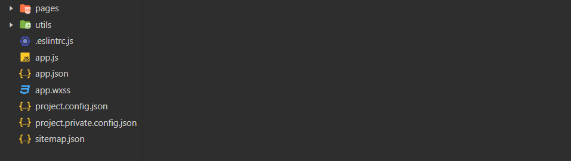
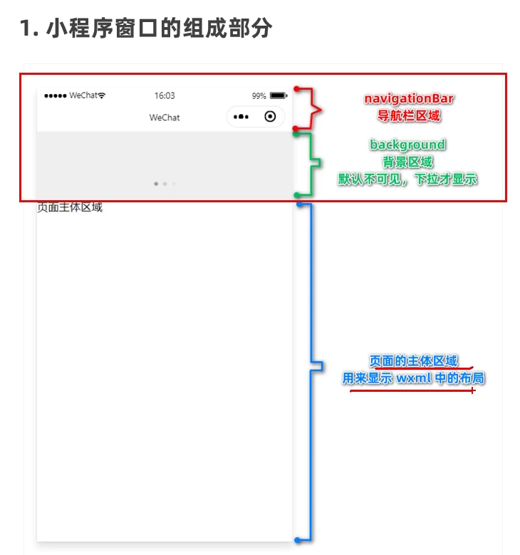
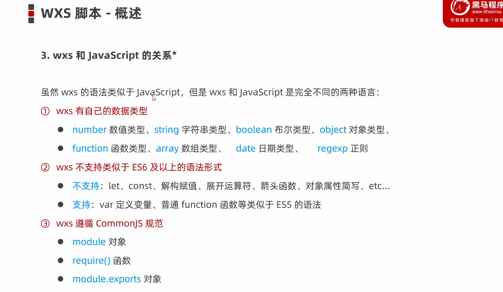

#### 小程序项目文件结构

---



app.js, app.json, app.wxss 这三个文件是页面的全局配置文件，app.js 中可定义全局变量，app.wxss 中定义的样式可作用于全局，app.json 配置页面信息和展示样式等内容

##### 全局 app.json 配置文件

1. **pages**

记录当前小程序所有页面的存放路径

2. **window**

全局设置小程序窗口的外观

```
  "window":{
    "backgroundTextStyle":"light",
    "navigationBarBackgroundColor": "#666",
    "navigationBarTitleText": "秀域加盟小程序",
    "navigationBarTextStyle":"black",
    "enablePullDownRefresh": true  //全局开启下拉刷新
  },
```



3. **tabBar**

设置小程序底部导航栏的效果

```
  "tabBar": {
//最少两个，最多五个
   "list": [{
      "pagePath": "pages/index/index",
      "text": "首页",
      "iconPath": "",
      "selectedIconPath": "" //选中时的icon
    }]
  },
```

4. **style**

是否启用新版组件样式

#### 小程序页面文件结构

小程序的每一个页面都配置在 pages 文件夹下，每一个页面包含 4 个类型文件

- js 文件编写页面逻辑
- wxml 文件编写页面结构
- wxss 编写的样式只能作用于当前页面
- json 文件为当前页面配置相关内容

##### 页面配置文件 page.json

详情： https://developers.weixin.qq.com/miniprogram/dev/reference/configuration/page.html

#### 小程序结构标签 WXML

- `<view></view> //类似于HTML的div元素`
- `<scroll-view></scroll-view> //可设置滚动区域`
- ```
  <swiper>
    <swiper-item></swiper-item>
  </swiper>
  // 小程序原生轮播图效果
  ```
- `<icon></icon> //icon图标`
- `<rich-text></rich-text> //类式于vue的v-html指令，可解析wxML结构字符串`
- `<text></text> //类式于HTML的span元素`
- `<navigator></navigator> //导航标签类式于HTML的a标签`

#### WXML 语法

##### 数据绑定

`<view>{{data}}</view>`

`<view hidden='{{boolean}}'></view>`

##### 列表渲染

```
<view wx:for="{{array}}" wx:key='{{index}}'>
  {{index}}: {{item}}
</view>
//默认索引名为index，默认每一项的名为item

//更改索引名或每一项的名称
<view wx:for='{{array}}' wx:for-index='indexName' wx:for-item='itemName'></view>
```

##### 条件渲染

```
<view wx:if="{{Boolean}}"> 1 </view>
<view wx:elif="{{Boolean}}"> 2 </view>
<view wx:else></view>
//一次控制多个元素的隐藏
<block></block>标签包裹，类式于vue的<template>标签不会多渲染不必要的节点

//hidden属性也可控制隐藏与显示, 与vue的v-show一样仅是控制元素的样式达到显示与隐藏的效果
<view hidden='{{boolean}}'></view>
```

#### WXSS，小程序模板样式

##### wxss 与 css

- wxss 可以使用 css 中的大部分选择器

##### wxss 的单位—— rpx

prx 把每一个屏幕宽度分为分为 750 份，每一份就是一个 rpx，所以一 rpx 在不同屏幕上有不同的大小

###### rpx 与 px 的换算

1rpx = (屏幕像素 / 750)px = (屏幕物理像素 / 750) 物理像素

**开发时建议以 iPhone6 为视觉稿标准**

iPhone6： 1rpx = 0.5px = 1 物理像素

##### wxss 样式导入

@import ‘wxss 的 path’

#### 小程序发送网络请求

```
wx.request({
      url: 'url', //请求路径
      method:'', //请求方式
      data:{}, //请求参数
      success:(res)=>{} //成功回调
    })
```

#### 导航

##### 声明式导航

`使用<navigator url='pagePath' open-type='switchTab'></navigator>`标签跳转

跳转到 tabbar 页面需要设置属性 `open-type='switchTab'`

跳转到非 tabbar 页面可设置属性 `open-type='navigate'// 也可以不写`

后退导航需设置 `<navigator url='pagePath' open-type='navigateBack' delta='{{number}}'></navigator> //delta为回退层数， 其默认值为1`

###### 传参

与 pc 端网址的 query 参数类式

##### 编程式导航

**使用 `wx.switchTab(object)`方法跳转至 tabBar 页面**

```
//参数对象的属性
url //tabbar页面路径，不能携带参数 必填
success //成功后的回调
fail //失败后的回调
compelete //无论失败或成功都会调用
```

**使用 `wx.navigateTo(object)`方法跳转至 tabBar 页面**

参数对象同上

###### 传参

`wx.navigateTo(object)的url上进行传参`

**使用 `wx.navigateBack(object)`方法回退页面**

```
//参数对象的属性
delta //回退层数， 默认为1
success //成功后的回调
fail //失败后的回调
compelete //无论失败或成功都会调用
```

##### 接收路由参数

两种导航方式传递的参数可以在 onLoad()事件中接收

```
onLoad: (option)=>{} //option是路由参数组成的对象
```

#### 页面事件

- 下拉刷新（可在 json 文件中配置）

onPullDownRefresh()

wx.stopPullDownRefresh()关闭下拉刷新效果

- 上拉触底

onReachBottom()

#### 生命周期

##### 小程序生命周期

```
App({
  //小程序初始化完成，执行此函数，全局触发一次
  onLaunch: ()=>{},

  //当小程序启动，或从后台进入前台显示，会触发 onShow
  onShow: (options)=>{},

  //当小程序从前台进入后台，会触发 onHide
  onHide:()=>{},

  //当小程序发生脚本错误，或者 api 调用失败时，会触发 onError 并带上错误信息
  onError: ()=>{}
})
```

##### 页面生命周期

```
page({
  //监听页面加载，一次页面调用一次
  onLoad: () => {},

  //页面初始化渲染完成，一个页面只调用一次
  onReady: () => {},

  onShow: () => {},
  onHide: () => {},

  //监听页面卸载，一个页面仅调用一次
  onUnload: () => {},
})
```

#### WXS



wxs 常用做过滤器方法

##### 内嵌 wxs 代码

wxs 可以内嵌于 wxml 文件中，类式于 html 文件中使用 script 标签编写脚本

```
<wxs module='wModule'>
module.export.key = {} //导出的属性即可在模板中使用 wModule.key
</wxs>
//module属性必填，指定wxs的模块名称

```

##### 单独的 wxs 文件

wxs 还可以编写在.wxs 文件中，类式于 js 文件

```
module.export = {} //在.wxs文件中导出属性
//使用
<wxs src='wxsPath' module='moduleName'></wxs> //使用外联wxs时，src和module属性必填
```
